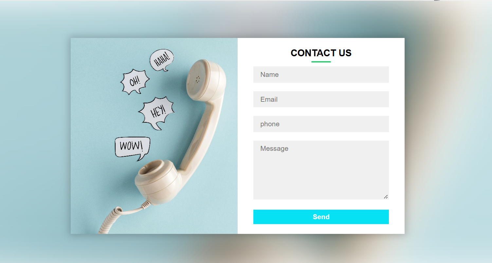

# 📬 Contact Form Web Page

A modern, responsive **Contact Us** form built with **HTML5** and **CSS3**. The layout includes a stylish blur background image, two-column card-style design, and an interactive form with validation.

## ✨ Features

- Responsive and mobile-friendly design
- Blurred background image with layered form card
- Elegant two-column layout
- Smooth transitions and hover/focus effects
- Form includes fields for Name, Email, Phone, and Message

## 🖼️ Preview

> Add a screenshot here if you'd like (e.g. `screenshot.png`)
> 

## 🚀 Getting Started

**🛠️ Built With**
HTML5
CSS3
Responsive Web Design Principles

**🧠 Learning Outcomes**
CSS Grid layout usage
Background filters and blur effects
Building mobile-friendly UI
Working with form fields and transitions

**📂 Project Structure**
contact-form-page
├── index.html      # Main HTML structure
├── style.css       # Stylesheet
└── bg.jpg          # Background image 
